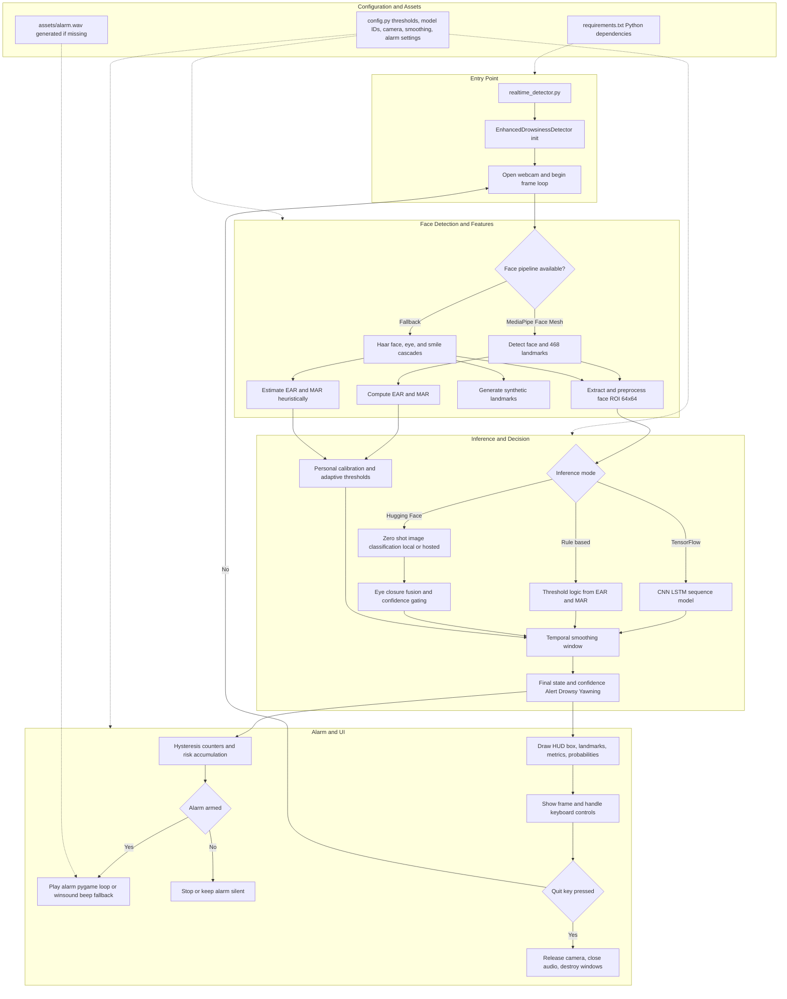

# Driver Drowsiness Prediction

Real-time driver-state detection from webcam frames with robust fallback behavior.

Current runtime mode is HF-first:
- Hugging Face zero-shot image classification is enabled by default.
- MediaPipe Face Mesh is used when available.
- Haar Cascade fallback is used when MediaPipe is unavailable or fails.
- Audio alarm escalation is triggered when drowsiness risk remains high across frames.

Last updated: 2026-04-16

## State Classes

The detector predicts three states:

| State | Meaning | Typical UI Color |
|---|---|---|
| Alert | Driver appears attentive | Green |
| Drowsy | Eyes closed or high fatigue risk | Red |
| Yawning | Mouth-open fatigue cue | Orange |

## Detailed Runtime Architecture (Mermaid)



## Codebase Layout

```text
driver-drowsiness-prediciton/
     .venv/
     assets/
          alarm.wav
     utils/
          __init__.py
          audio_alarm.py
          face_utils_enhanced.py
          huggingface_inference.py
     config.py
     realtime_detector.py
     realtime_detector_enhanced.py
     requirements.txt
     yawdd-dataset.ipynb
```

## Component Responsibilities

- realtime_detector.py
     - Minimal entrypoint that starts EnhancedDrowsinessDetector with HF enabled by default.

- realtime_detector_enhanced.py
     - Main runtime loop.
     - Model/backend loading (HF or TensorFlow).
     - Temporal smoothing, calibration, eye-closure fusion, alarm hysteresis, and HUD.

- utils/face_utils_enhanced.py
     - Face pipeline with MediaPipe primary path.
     - Haar fallback for face/eye/smile detection.
     - EAR and MAR computation plus smoothing.
     - Face ROI preprocessing.

- utils/huggingface_inference.py
     - Zero-shot image classification wrapper.
     - Local Transformers backend and hosted Hugging Face API fallback.

- utils/audio_alarm.py
     - Alarm file generation (if missing).
     - Pygame loop playback with Windows system-beep fallback.

- config.py
     - All thresholds, camera/display settings, smoothing windows, backend defaults, and alarm parameters.

## Setup

### 1) Create and activate virtual environment

Windows PowerShell:

```powershell
python -m venv .venv
Set-ExecutionPolicy -Scope Process -ExecutionPolicy RemoteSigned
& ".\.venv\Scripts\Activate.ps1"
```

macOS/Linux:

```bash
python -m venv .venv
source .venv/bin/activate
```

### 2) Install dependencies

```bash
pip install -r requirements.txt
```

## Run

Default launch:

```bash
python realtime_detector.py
```

Direct enhanced launch:

```bash
python realtime_detector_enhanced.py --hf --hf-backend local
```

## Runtime Controls

- q: quit
- r: reset alarm counters
- s: save current frame as an image

## CLI Options (realtime_detector_enhanced.py)

```text
--model <path>          Path to TensorFlow .keras model
--camera <index>        Declared in CLI, currently not wired into runtime capture
--ensemble              Enable ensemble loading if multiple models exist
--no-smooth             Disable temporal smoothing
--rule-based            Request rule-based mode (see notes below)
--hf                    Enable Hugging Face backend
--hf-model <id>         Hugging Face model id
--hf-backend <mode>     auto | local | hosted
```

## Inference Modes

### 1) Hugging Face (default)

- Enabled through USE_HUGGINGFACE = True in config.py.
- Uses model id from HF_MODEL_ID (default: openai/clip-vit-base-patch32).
- Backend behavior:
     - local: Transformers pipeline on local machine.
     - hosted: Hugging Face Inference API.
     - auto: local first, then hosted fallback.

### 2) TensorFlow CNN-LSTM

- Used when HF is disabled/unavailable and model files exist.
- Looks for:
     - saved_models/best_model.keras
     - then saved_models/final_model.keras
- Supports compatibility loading for legacy BatchNormalization renorm fields.

### 3) Rule-Based Fallback

- Uses EAR and MAR thresholds with adaptive logic.
- Also engaged automatically when no model backend is available.

## Key Configuration Defaults

| Key | Value | Purpose |
|---|---|---|
| IMG_SIZE | 64 | Face ROI size |
| SEQUENCE_LENGTH | 20 | Temporal frame window |
| CAMERA_INDEX | 0 | Webcam index |
| DISPLAY_WIDTH / DISPLAY_HEIGHT | 1280 / 720 | Display resolution |
| EAR_THRESHOLD | 0.21 | Eye-closure baseline threshold |
| MAR_THRESHOLD | 0.65 | Yawn baseline threshold |
| ALARM_CONSECUTIVE_FRAMES | 5 | Alarm frame counter threshold |
| ALARM_TRIGGER_THRESHOLD | 0.70 | Drowsiness probability gate |
| TEMPORAL_SMOOTHING_WINDOW | 5 | Prediction smoothing window |
| HF_BACKEND | local | Default HF backend mode |
| HF_CONFIDENCE_THRESHOLD | 0.22 | HF confidence gate |

## Practical Notes

- First run with local HF backend can take time due to model download and cache warmup.
- On environments where MediaPipe Face Mesh is unavailable (common on some Python 3.13 setups), runtime falls back to Haar pipeline automatically.
- If hosted HF backend is used, set one of these environment variables for authentication:
     - HF_TOKEN
     - HUGGINGFACEHUB_API_TOKEN
- assets/alarm.wav is generated automatically if missing.

## Known Limitations

- The --camera argument is currently parsed but not applied to capture initialization; runtime still uses CAMERA_INDEX from config.py.
- With USE_HUGGINGFACE set to True, passing --rule-based alone may still keep HF active if HF backend initializes successfully.
- This repository currently focuses on runtime inference. End-to-end training scripts are not included in the current workspace snapshot.

## Troubleshooting

### Webcam does not open

- Check camera permissions in OS settings.
- Confirm no other application is locking the webcam.
- Try a different camera index in config.py.

### Frequent false alarms

- Increase ALARM_CONSECUTIVE_FRAMES.
- Increase ALARM_TRIGGER_THRESHOLD.
- Tune EAR_THRESHOLD and MAR_THRESHOLD after short calibration runs.

### Hugging Face backend errors

- For local mode, ensure torch and transformers are installed.
- For hosted mode, ensure token environment variable is set.
- If network/API errors occur, classifier fails safe to Alert bias.

## Minimal Start Checklist

1. Install requirements.
2. Run python realtime_detector.py.
3. Confirm webcam feed appears.
4. Test q, r, s controls.
5. Verify alarm audio is audible when sustained drowsiness is simulated.
