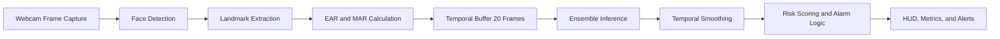
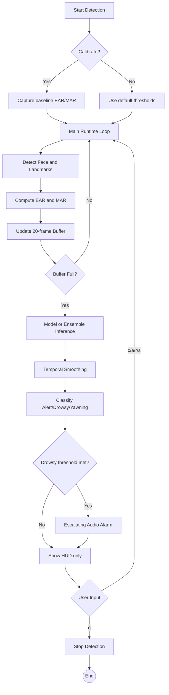

# 🚗 Real-Time Driver Drowsiness Detection System

[](https://www.python.org/)
[](https://www.tensorflow.org/)
[](LICENSE)
[](https://www.python.org/)

---

## 📌 Overview

This repository contains a production-focused, real-time driver drowsiness detection system built with computer vision and deep learning. It monitors facial cues from a webcam stream, models temporal behavior over frame sequences, and triggers escalating alarms when drowsiness risk crosses safety thresholds.

The solution is designed to be practical for demos, hackathons, portfolio showcases, and applied ML engineering workflows.

**Last updated:** 2026-04-17

---

## 🎯 What This System Delivers

- Real-time driver-state classification: Alert, Drowsy, Yawning
- Temporal sequence modeling with MobileNetV3 + BiLSTM
- Landmark-based safety features (EAR/MAR)
- Ensemble and fallback inference paths for robustness
- Low-latency monitoring with live HUD and alarm escalation
- End-to-end workflow: training, evaluation, profiling, visualization

---

## 🧠 Key Results

- Dataset scale: **66,521 labeled images**
- Classes: **Alert, Drowsy, Yawning**
- Best reported model accuracy: **92.34%**
- Typical runtime performance: **~29 FPS**, **~34 ms latency**
- Training support: checkpointing, early stopping, TensorBoard, class balancing

---

## 🏗️ System Architecture

### Processing Flow (Webcam to Alert)

The runtime pipeline follows this sequence:

1. **Webcam Capture**
2. **Face Detection** (MediaPipe, with fallback options)
3. **Landmark Extraction** (eye and mouth keypoints)
4. **Feature Calculation** (EAR and MAR)
5. **Temporal Analysis** (20-frame window)
6. **Model Inference** (primary model + optional ensemble/HF backend)
7. **Alert Decision** (smoothing, hysteresis, consecutive-frame logic)
8. **Output** (HUD overlays, logs, audio alarm)

### High-Level Pipeline



### Real-Time Detection Workflow



---

## 🗂️ Project Structure

```text
driver-drowsiness-prediciton/
├── README.md
├── CHECKLIST.md
├── config.py
├── realtime_detector.py
├── realtime_detector_enhanced.py
├── train_custom_dataset.py
├── train.py
├── evaluation.py
├── performance_profiler.py
├── monitor_training.py
├── metrics_collector.py
├── visualizations.py
├── generate_visualizations_demo.py
├── requirements.txt
├── training.log
├── assets/
│   └── alarm.wav
├── saved_models/
│   ├── best_model.keras
│   ├── final_model.keras
│   └── logs/
├── utils/
│   ├── __init__.py
│   ├── audio_alarm.py
│   ├── face_utils_enhanced.py
│   └── huggingface_inference.py
└── visualization_results/
    ├── evaluation/
    ├── realtime_metrics/
    └── training/
```

### File Guide

- **realtime_detector_enhanced.py**: Main production runtime detector (recommended entry point)
- **realtime_detector.py**: Baseline runtime detector
- **train_custom_dataset.py**: Specialized trainer for custom drowsy/notdrowsy dataset layout
- **train.py**: Generalized main training pipeline with augmentation, callbacks, and export
- **evaluation.py**: Offline evaluator for videos/frames with confusion matrix and classification metrics
- **performance_profiler.py**: FPS/latency/memory profiler with report generation
- **monitor_training.py**: Live training monitor for checkpoints and TensorBoard artifacts
- **metrics_collector.py**: Runtime metric capture and summary utilities
- **visualizations.py**: Visualization engine for evaluation, training, and runtime analytics
- **CHECKLIST.md**: Development validation checklist and quality milestones
- **config.py**: Global constants and thresholds for training and runtime

---

## ⚙️ Installation

### Prerequisites

- Python 3.8+
- Webcam (USB or built-in)
- 4 GB RAM minimum (8 GB recommended)
- Optional GPU for faster training

### Setup Steps

1. Open a terminal in the project directory.
2. Create and activate a virtual environment.
3. Install dependencies from requirements.

```bash
# Windows
python -m venv .venv
.venv\Scripts\activate

# Linux / macOS
python3 -m venv .venv
source .venv/bin/activate

pip install --upgrade pip
pip install -r requirements.txt
```

### Verify Installation

```bash
python -c "import tensorflow as tf; import cv2; import mediapipe as mp; print('Environment ready')"
```

---

## 🎮 Usage

### 1) Run Real-Time Detection (Recommended)

```bash
python realtime_detector_enhanced.py
```

**Keyboard controls:**

| Key | Action |
|-----|--------|
| c | Run personal threshold calibration |
| a | Toggle audio alarm on/off |
| r | Reset runtime state and buffers |
| s | Save current metrics/log output |
| q | Quit detection |

### 2) Train on Custom Dataset Structure

```bash
python train_custom_dataset.py \
  --data-dir "path/to/train" \
  --epochs 100 \
  --batch-size 16 \
  --augmentation-prob 0.7
```

### 3) Run Main Training Pipeline

```bash
python train.py \
  --data-dir "path/to/dataset" \
  --epochs 100 \
  --batch-size 16 \
  --output-dir "saved_models"
```

### 4) Evaluate a Model

```bash
# Evaluate video
python evaluation.py --video "path/to/test_video.mp4" --output-dir "evaluation_reports"

# Evaluate frame directory (+ optional labels JSON)
python evaluation.py --frames-dir "path/to/frames" --labels "path/to/labels.json" --output-dir "evaluation_reports"
```

### 5) Monitor Training in Real Time

```bash
python monitor_training.py
```

### 6) Generate Visualization Demo Assets

```bash
python generate_visualizations_demo.py
```

### 7) Use Performance Profiler in Runtime Loops

```python
from performance_profiler import PerformanceProfiler, ProfilerContext

profiler = PerformanceProfiler(window_size=300)

# inside frame loop
with ProfilerContext(profiler, 'face_detection'):
    pass

with ProfilerContext(profiler, 'inference'):
    pass

profiler.record_frame_time(0.034)  # example frame latency
profiler.record_memory()

profiler.print_report()
profiler.save_report(output_dir='performance_reports')
```

---

## 📊 Dataset Summary

The model training setup in this repository is based on the following distribution:

| Class | Count | Percentage | Interpretation |
|------|------:|-----------:|----------------|
| Alert | 30,491 | 45.8% | Driver is attentive, eyes open |
| Drowsy | 27,168 | 40.8% | Fatigue-related eye behavior |
| Yawning | 8,862 | 13.3% | Yawning and mouth-open fatigue cue |
| **Total** | **66,521** | **100%** | Multi-class safety dataset |

---

## 📈 Performance Metrics

The table below summarizes representative model performance from the reported evaluation workflow.

| Metric | Value | What It Means |
|-------|------:|---------------|
| Accuracy | 92.34% | Overall fraction of correct predictions across all classes |
| Precision (weighted) | 0.91 | Of all predicted labels, how many were correct (weighted by class frequency) |
| Recall (weighted) | 0.92 | Of all true labels, how many were successfully detected |
| F1-score (weighted) | 0.91 | Harmonic balance of precision and recall |
| ROC-AUC (OvR) | >0.95 | Class separability quality across one-vs-rest decision boundaries |

### Metric Interpretation (Short)

- **Accuracy** is a high-level quality signal but can hide class imbalance effects.
- **Precision** is critical when reducing false drowsy alarms.
- **Recall** is critical for safety, because missed drowsy events are high risk.
- **F1-score** balances both precision and recall in one number.

---

## 🖼️ Visualization Gallery and Insights

All visualization assets in this README point to existing files in visualization_results.

### 1) Confusion Matrix

**Insight:** Shows where classes are confused and where classification is strongest (diagonal dominance).


### 2) Classification Metrics (Precision / Recall / F1)

**Insight:** Highlights class-wise reliability and whether performance is balanced across Alert, Drowsy, and Yawning.


### 3) ROC-AUC Curves

**Insight:** Measures separability per class; higher curves and AUC values indicate stronger decision boundaries.


### 4) Training History

**Insight:** Confirms convergence behavior and helps identify overfitting/underfitting trends.


### 5) EAR Over Time

**Insight:** Tracks eye-closure dynamics; sustained low EAR windows correlate with drowsiness risk.


### 6) MAR Over Time

**Insight:** Captures yawning dynamics through sustained mouth opening patterns.


### 7) Blink Rate

**Insight:** Reveals blink-frequency shifts that often precede or accompany fatigue.


### 8) Prediction Distribution

**Insight:** Summarizes model output proportions across a full runtime session.


### 9) Confidence Scores

**Insight:** Indicates prediction certainty and stability over time.


### 10) FPS and Latency

**Insight:** Validates real-time feasibility and runtime consistency under continuous processing.


---

## 🛡️ Reliability and Production Notes

- MediaPipe-based landmarking with fallback logic in runtime flow
- Temporal smoothing and hysteresis reduce alert jitter
- Consecutive-frame alarm triggering improves stability
- Profiled runtime metrics support deployment validation
- Multiple training scripts cover both generic and custom dataset formats

---

## 🧩 Common Challenges and Mitigations

### Class Imbalance

- Mitigation: class weighting + augmentation
- Outcome: improved minority-class robustness (Yawning class)

### False Positives in Real-Time

- Mitigation: temporal smoothing + consecutive-frame gating + confidence thresholds
- Outcome: fewer transient false alarms

### Runtime Variability

- Mitigation: profiler-driven tuning (latency, FPS, memory)
- Outcome: stable runtime behavior around real-time targets

---

## 🧪 Troubleshooting

- If webcam is not detected, verify camera index and OS permissions.
- If inference is slow, reduce frame size or prediction frequency in config.py.
- If MediaPipe APIs differ on newer Python versions, use the provided fallback paths and keep dependencies pinned from requirements.txt.
- If TensorFlow model load fails, verify saved_models contains a valid best_model.keras or final_model.keras.

---

## 🚀 Portfolio and Resume Highlights

This project demonstrates:

- End-to-end ML lifecycle (data, training, evaluation, deployment)
- Real-time CV + sequence modeling in production-style Python code
- Safety-focused decision logic (thresholding + temporal risk controls)
- Practical observability (profiling, monitoring, visual analytics)

---

## 📋 Validation Checklist

Development and validation progress is tracked in:

- CHECKLIST.md

Use this file to verify training readiness, runtime robustness, and deployment quality gates.

---

## 🤝 Support and Contribution

- For bugs or feature requests, use the repository Issues tab.
- For technical discussions and improvements, use repository Discussions.
- Pull requests with measurable improvements (accuracy, latency, robustness, docs) are welcome.

---

## 📄 License

This project is released under the MIT License.

---

<div align="center">

Built for safer roads with applied AI engineering.

</div>
