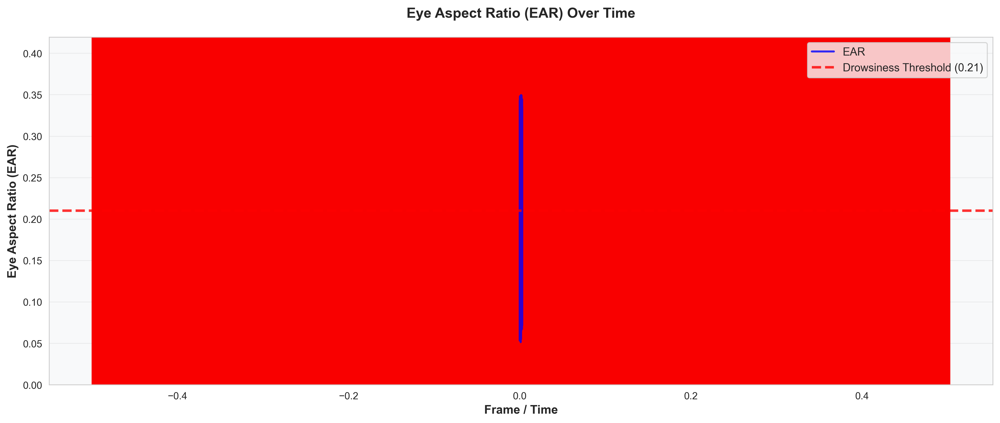
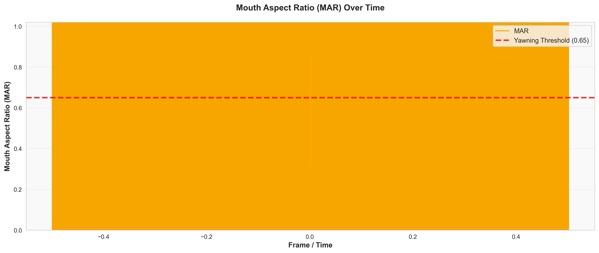
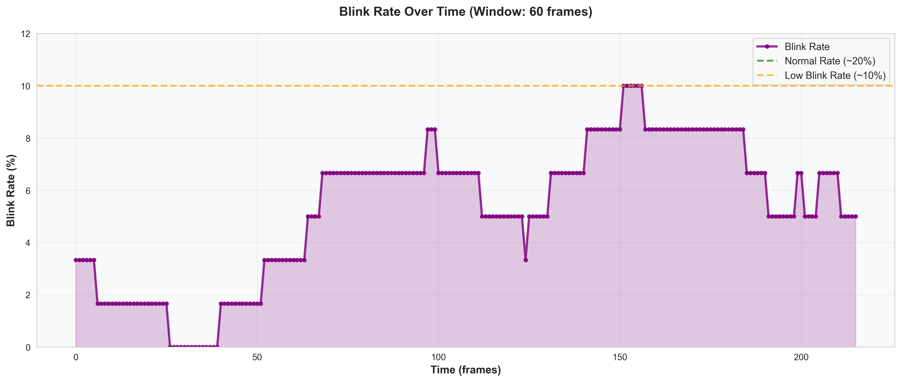
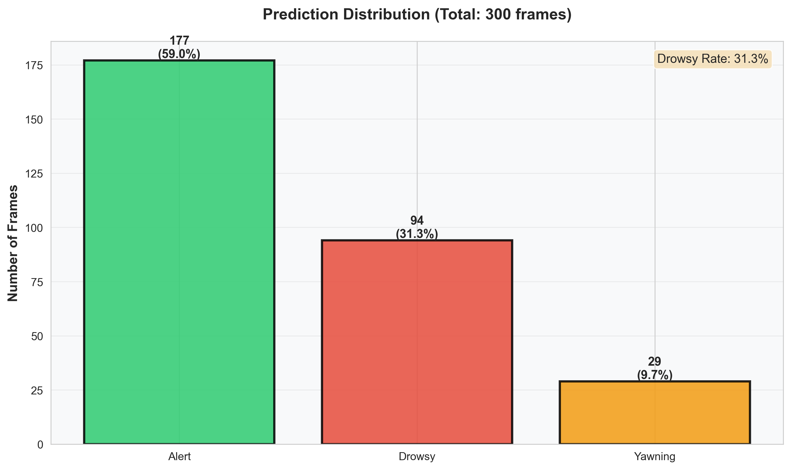
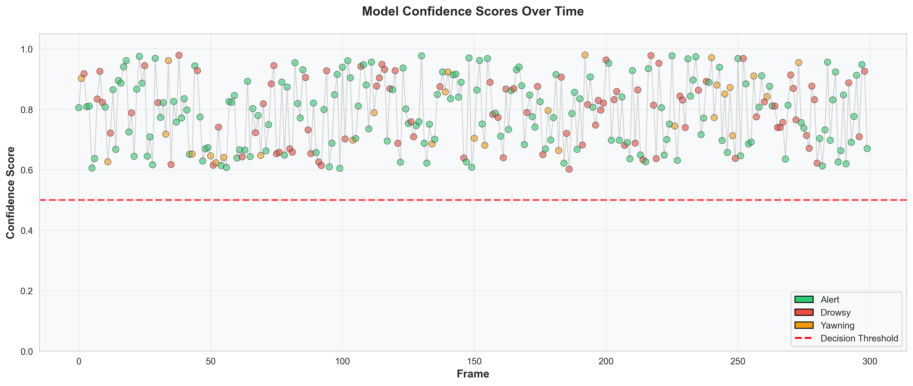
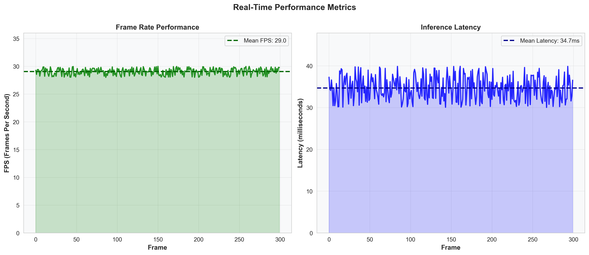

# Drowsiness Detection System - Visualizations

Generated: 2026-04-17 09:50:36

## Generated Plots

### Eye Aspect Ratio

### Mouth Aspect Ratio

### Blink Rate

### Prediction Distribution

### Confidence Scores

### FPS & Latency

